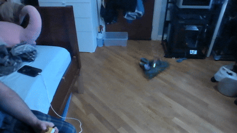

<div align="center">

# Angelo Demetroulakos — Engineering Portfolio

### Designing, building, and programming machines that move.

Mechanical engineering, robotics, CAD, rapid prototyping, and autonomous systems—all in one interactive portfolio.

[View the Live Portfolio](https://aloeveraz.github.io/) · [Explore the Projects](https://aloeveraz.github.io/#projects) · [Get in Touch](mailto:angelojames2006@gmail.com)

</div>

---

## About the Portfolio

This site documents my work as a Mechanical Engineering Technology student and hands-on builder in New York City. It brings together competition robotics, custom motion systems, 3D printing, CAD, electronics, and software—from early concepts to working prototypes.

The portfolio is designed to make each project easy to explore. Projects are organized by category, presented through interactive cards, and expanded into detailed views with build notes, media, technical tags, and external resources.

## Featured Build: Kiwi Swerve Drivetrain

<div align="center">
  
</div>

The **Kiwi Swerve Drivetrain** is a low-power, affordable, three-module omnidirectional drive platform built for robotics competitions and education.

- Three independently steered drive modules
- Raspberry Pi control system programmed in Python
- Closed-loop steering with encoder feedback
- Custom electronics using accessible, maintainable components
- 3D-printed, CNC-machined, and off-the-shelf mechanical parts

[See the project on the live site](https://aloeveraz.github.io/#projects)

## Engineering Toolkit

| Area | Tools & Technologies |
| --- | --- |
| CAD & Design | Fusion 360, Autodesk Inventor, SolidWorks, AutoCAD, Blender, FEA |
| Manufacturing | FDM/SLA/SLS 3D printing, laser cutting, manual mills and lathes, rapid prototyping |
| Software & Controls | Python, MATLAB, Arduino, Raspberry Pi, Klipper |
| Web | HTML, CSS, JavaScript, JSON, GitHub Pages |

## How the Site Works

The portfolio is a lightweight, data-driven static site built without a framework:

- `data.json` holds profile details, skills, project collections, and project content.
- `app.js` renders cards, collections, project modals, media, and contact links.
- `styles.css` provides the responsive visual system, animations, and mobile layout.
- `assets/` contains project photography, renders, and demonstrations.

Because the content is separated from the interface, new projects can be added without rebuilding the page structure.

## Run Locally

Clone the repository and serve it with any static file server:

```bash
git clone https://github.com/AloeVeraZ/AloeVeraZ.github.io.git
cd AloeVeraZ.github.io
python -m http.server 8000
```

Then open [http://localhost:8000](http://localhost:8000).

## Project Status

The portfolio is actively growing. Additional project write-ups, media, CAD resources, and technical documentation will be added as builds are completed and documented.

---

<div align="center">

Built from scratch by [Angelo Demetroulakos](https://github.com/AloeVeraZ).

</div>
