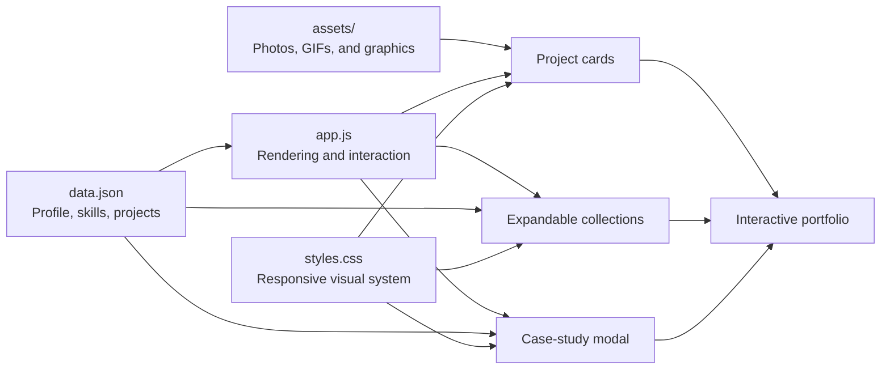

<div align="center">

# Angelo Demetroulakos | Engineering Portfolio

### Designing, building, and programming machines that move.

[](https://aloeveraz.github.io/)
[](https://aloeveraz.github.io/#projects)
[](https://github.com/AloeVeraZ)
[](mailto:angelojames2006@gmail.com)

Mechanical engineering, robotics, CAD, rapid prototyping, controls, and autonomous systems in one interactive portfolio.

[Explore the Website](https://aloeveraz.github.io/) · [Jump to Projects](https://aloeveraz.github.io/#projects) · [View Source](https://github.com/AloeVeraZ/AloeVeraZ.github.io)

</div>

---

> [!NOTE]
> This repository contains the source for Angelo's actively maintained engineering portfolio. Project data, case studies, media, and external resources are rendered from a lightweight JSON-driven interface.

## Portfolio Preview

<div align="center">
  <a href="https://aloeveraz.github.io/#projects">
    
  </a>

  <sub>Kiwi Swerve Drivetrain — click the preview to explore the project collection.</sub>
</div>

## At a Glance

| Area | Details |
| --- | --- |
| Focus | Mechanical engineering, robotics, 3D printing, controls, and prototyping |
| Project library | 16 documented projects across four collections |
| Personal builds | 9 robotics and custom 3D-printer projects |
| Academic work | AutoCAD, Mastercam, and MATLAB coursework |
| Controls | Python, MATLAB, Arduino, Raspberry Pi, and Klipper |
| CAD | Fusion 360, Autodesk Inventor, SolidWorks, AutoCAD, and Blender |
| Front end | Semantic HTML, responsive CSS, vanilla JavaScript, and JSON |
| Hosting | GitHub Pages |

## About the Portfolio

This site documents my work as a Mechanical Engineering Technology student and hands-on builder in New York City. It brings together competition robots, custom motion systems, modified 3D printers, academic work, electronics, software, and research—from early concepts to tested prototypes.

The experience is organized around interactive project collections. Each personal project opens into two intentionally different levels of detail:

| View | Purpose | Structure |
| --- | --- | --- |
| **At a Glance** | A fast case-study overview | Problem · Method · Result |
| **Technical Deep Dive** | The engineering story behind the build | Project-specific sections such as Challenge, Mechanical Design, Controls, Programming, Iterations, Status, and Result |

> [!TIP]
> Open any personal-project image or title on the live site to see the case-study modal. The first row is designed for quick scanning; the sections below preserve the full technical depth without repeating the same wording.

## Featured Build: Kiwi Swerve Drivetrain

The **Kiwi Swerve Drivetrain** is a low-power, affordable three-module omnidirectional drive platform built for robotics competitions and education.

| System | Implementation |
| --- | --- |
| Drivetrain | Three independently steered modules |
| Controller | Raspberry Pi |
| Software | Python with Kiwi swerve kinematics |
| Steering | Continuous-rotation servos with encoder feedback |
| Electronics | Servo HAT, motor drivers, and a 12-bit encoder board |
| Construction | 3D-printed parts, CNC-machined plates, and accessible hardware |
| Current status | First prototype validated; V2 in development |

[Open the project collection](https://aloeveraz.github.io/#projects) · [Read the full project page](https://angelojamesny.com/dorito)

## Project Collections

| Collection | Projects | Highlights |
| --- | ---: | --- |
| **Personal Projects** | 9 | Swerve drivetrains, competition robots, an animatronic AI assistant, and custom printers |
| **Club Projects** | 2 | Self-balancing PID robots and ESP32 crab crawlers |
| **Coursework** | 3 | AutoCAD drafting, Mastercam CNC workflows, and MATLAB engineering computing |
| **Awards & Research** | 2 | CUNY geopolymer printing research and NSF manufacturing training |

<details>
<summary><strong>See the complete project index</strong></summary>

### Personal Projects

- Kiwi Swerve Drivetrain
- A-Eye Animatronic Chatbot
- Coaxial Swerve Drive
- Simple Swerve Drive
- FTC 9384 Robot: EggWUUUHH
- FTC 9384 Robot: Crabby
- ZeroG Hydra 3D Printer
- Delta 3D Printer
- Voron V0.2990

### Club Projects

- Self-Balancing Robot
- Crab Crawler

### Coursework

- AutoCAD Coursework
- Mastercam Coursework
- MATLAB Coursework

### Awards & Research

- CUNY Research: 3D Printing With Geopolymers
- NSF Advanced Manufacturing Training

</details>

## Engineering Toolkit

| Discipline | Tools and Technologies |
| --- | --- |
| CAD & Design | AutoCAD, Fusion 360, Autodesk Inventor, SolidWorks, Blender, FEA, rendering, and animation |
| Manufacturing | FDM/SLA/SLS printing, laser cutting, manual mills and lathes, hand tools, and rapid prototyping |
| Software & Controls | Python, MATLAB, Arduino, Raspberry Pi, Klipper, and block coding |
| Web | HTML5, CSS3, JavaScript, JSON, Font Awesome, and GitHub Pages |

## How the Site Works



The site is framework-free and data-driven:

- [`data.json`](./data.json) stores profile information, skills, collections, project summaries, overview copy, technical sections, media, and links.
- [`app.js`](./app.js) builds the interface, project cards, carousels, collection accordions, modal content, and visual interactions.
- [`styles.css`](./styles.css) defines the responsive layout, engineering-inspired visual language, animations, and mobile behavior.
- [`index.html`](./index.html) provides the semantic page structure and modal shell.
- [`assets/`](./assets/) contains project photos, animated demonstrations, and coursework graphics.

## Repository Layout

```text
.
├── assets/                  # Project images, GIFs, and coursework art
├── index.html               # Main portfolio document
├── styles.css               # Responsive design system and effects
├── app.js                   # Current rendering and interaction logic
├── data.json                # Portfolio content and project case studies
├── pages/                   # Legacy multipage project template
├── js/                      # Legacy multipage application script
└── README.md                # Repository documentation
```

> [!IMPORTANT]
> The live one-page portfolio uses the root-level `index.html`, `app.js`, `styles.css`, and `data.json`. The `pages/` and `js/` folders are retained as legacy structure and are not the primary implementation.

## Run Locally

This is a static site, so no package installation or build step is required.

```bash
git clone https://github.com/AloeVeraZ/AloeVeraZ.github.io.git
cd AloeVeraZ.github.io
python -m http.server 8000
```

Open [http://localhost:8000](http://localhost:8000) in a browser.

> [!CAUTION]
> Do not open `index.html` directly from the filesystem. The browser may block the `data.json` request. Use a local static server so project content loads correctly.

<details>
<summary><strong>Alternative local servers</strong></summary>

With Node.js:

```bash
npx serve .
```

With PHP:

```bash
php -S localhost:8000
```

</details>

## Add or Update a Project

1. Add the project image or GIF to [`assets/`](./assets/).
2. Add a project record to [`data.json`](./data.json).
3. Set its `category` and `collectionOrder` so it appears in the intended collection.
4. For a personal project, include a concise `overview` with `problem`, `method`, and `result` fields.
5. Add distinct technical `sections` for the deeper engineering narrative.
6. Include any available GitHub, GrabCAD, video, or project-page links.
7. Serve the site locally and test the card, modal, media, and mobile layout.

Example structure:

```json
{
  "id": "project-slug",
  "title": "Project Name",
  "category": "Robotics",
  "collectionOrder": 1,
  "summary": "A one-sentence card description.",
  "image": "assets/project-image.jpg",
  "tags": ["CAD", "Python", "Controls"],
  "overview": {
    "problem": "The engineering need or constraint.",
    "method": "The high-level design approach.",
    "result": "The outcome or current status."
  },
  "sections": [
    {"heading": "Challenge", "body": "The detailed project context."},
    {"heading": "Mechanical Design", "body": "The physical implementation."},
    {"heading": "Controls", "body": "The software and electronics approach."},
    {"heading": "Result", "body": "The measured outcome and lessons learned."}
  ]
}
```

## Status

> [!NOTE]
> The portfolio is actively growing. New project write-ups, CAD resources, media, coursework, and technical documentation are added as builds are completed and documented.

---

<div align="center">

Built from scratch by **[Angelo Demetroulakos](https://github.com/AloeVeraZ)**.

[Website](https://aloeveraz.github.io/) · [Projects](https://aloeveraz.github.io/#projects) · [Email](mailto:angelojames2006@gmail.com)

</div>
